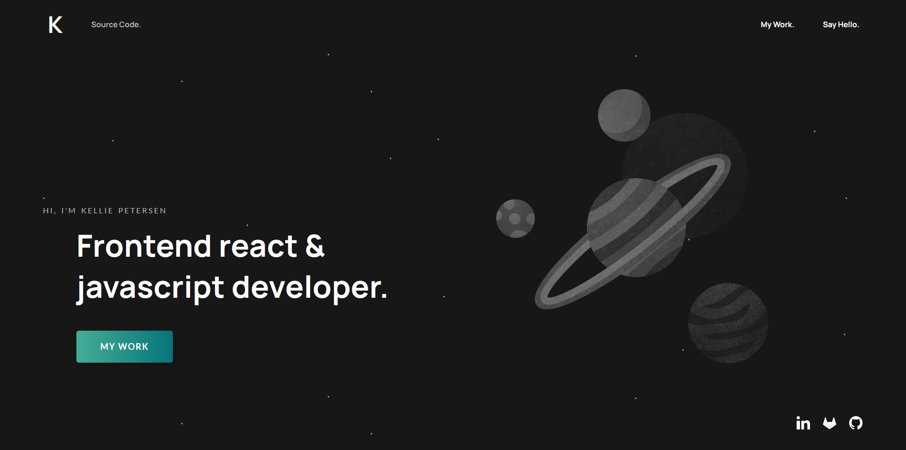

# Portfolio 2020  

Old version of my portfolio website. A two-page static website made with Gatsby using the default starter. 

[kelliepetersen.github.io/portfolio/](https://kelliepetersen.github.io/portfolio/ "Deprecated Portfolio website link")

(The newest portfolio can be found at 
[kelliepetersen.com](https://kelliepetersen.com "Current portfolio website link")
and 
[GitHub Repo](https://github.com/KelliePetersen/software-engineer-portfolio "Current portfolio Github repository"))

